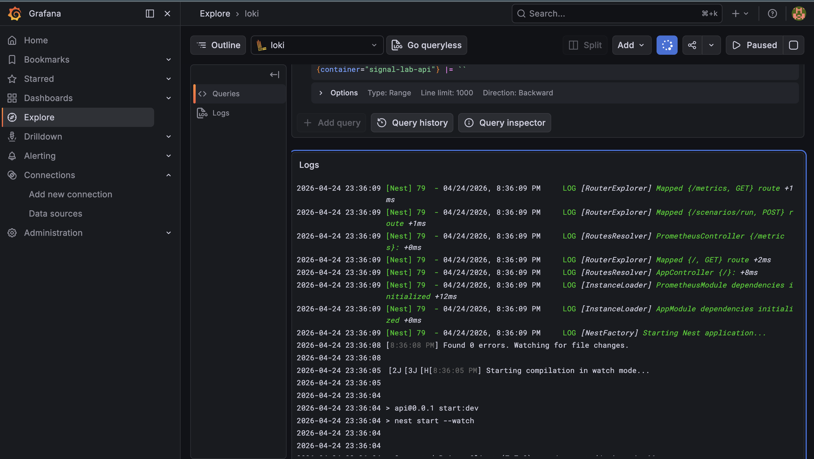

# 🛰️ Signal Lab — Observability Playground

Проект для генерации и мониторинга системных сигналов (логи, метрики, ошибки).

## Дополнения 
# База проливается автоматически
```bash
JUST RUN: docker-compose up -d
```
###  Verification Walkthrough
```bash
  docker-compose up -d --build
```
> Open http://localhost:3002 (admin/admin)<br/>
> Navigate to Explore -> Select Loki<br/>
> Query {container="signal-lab-api"} to see live logs.<br/>

<p align="center">
  
</p>

## Cursor & Marketplace Skills
В проекте используются пользовательские правила курсора для разработки с поддержкой ИИ. Правила находятся в каталогах .cursorrules и .cursor/ и обеспечивают соблюдение архитектурных стандартов NestJS и стандартов логирования.

## Hooks и Commands
Автоматизация запуска: файл Makefile в корне проекта. 
Это те самые "Commands". Теперь проект запускается одной командой make setup.

## 🚀 Быстрый старт

### 1.0. Запуск всей инфраструктуры (Docker)
Из корня проекта запустите ядро и мониторинг:
```bash
docker-compose up -d --build
```
### 1.2. Подготовка базы данных
```bash
docker-compose exec api npx prisma migrate dev --name init
```
### 1.3. Запуск панели управления (UI)
```bash
cd apps/web
npm install
npm run dev
```

### 1.4. Просмотр логов (Real-time)
Чтобы увидеть, как генерируются сигналы в бэкенде:
```bash
docker-compose logs -f api
# Development Timeline & Process
```
## ⏱ Отчет о разработке (Development Process)
Проект был реализован в рамках таймбокса (целевое время 6–8 часов) с четким разделением на этапы для обеспечения качества архитектуры и наблюдаемости.
### Этап 1: Инфраструктурный фундамент (День 1, 16:00 – 20:00)
Фокус: Контейнеризация и Observability Stack.
Результат: Развернуты Docker-контейнеры (PostgreSQL, Prometheus, Loki, Grafana). Настроены provisioning конфиги для автоматического подключения источников данных в Grafana.
Итог: Стабильная среда, готовая к приему сигналов.
### Этап 2: Ядро и Интеграция (День 1, 21:00 – 01:00)
Фокус: Backend-логика, Prisma и Метрики.
Результат: Инициализирован NestJS API. Внедрен PrometheusModule для сбора рантайм-метрик и Winston для структурированного JSON-логирования. Реализована схема Prisma и миграции для сохранения истории сценариев.
### Этап 3: UI-слой и AI-автоматизация (День 2, 09:00 – 11:20)
Фокус: Frontend (Next.js), Полировка UI и AI-слой (.cursor).
Результат: Разработан интерфейс Signal Lab на Next.js с использованием shadcn/ui. Настроены .cursor/rules и commands для обеспечения автономной работы ИИ-агента в контексте проекта.
Итог: Полная сквозная проверка системы (End-to-End) — от клика в UI до появления лога в Loki и записи в БД.
